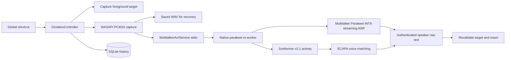

# Architecture

FlowLocal is a Windows 11 x64 WPF tray app targeting .NET 9. `FlowLocal.Core` contains contracts, models, and state transitions; `FlowLocal.App` contains the UI and Windows integrations; `FlowLocal.AsrWorker` owns the native inference process. Composition lives in `App.OnStartup` without a DI container.

## Dictation flow

On shortcut-down, the controller snapshots the foreground target, creates a history row and WAV recording, starts the ASR session, then captures 16 kHz mono PCM. Context/style and coding-harness signals can still be recorded as metadata; they do **not** rewrite the transcript. Shortcut-up stops capture, finalizes ASR, and passes the raw authenticated-speaker text directly to the existing safe insertion pipeline. Empty/no-match results fail rather than inserting other voices. `ActiveTargetTracker` validates process, integrity, and focused element before insertion. The insertion service uses UI Automation, transactional clipboard paste, or Unicode `SendInput` where safe; terminal targets use paste only. It does not press Enter.

## Worker and speaker boundary

The C# worker downloads pinned ONNX assets into `%LOCALAPPDATA%\FlowLocal\Models` and forwards JSON-line commands and events to `flowlocal-asr-native.exe`. The native worker keeps its ONNX sessions resident. The vendored parakeet-rs Multitalker pipeline consumes 1.12-second streaming audio windows, uses 80 ms Sortformer activity frames expanded onto 10 ms ASR feature frames, and maintains per-speaker decoder state. During enrollment, the ECAPA verifier stores a normalized 192-dimensional embedding under `%LOCALAPPDATA%\FlowLocal\user-embedding.json`; only an embedding is persisted. During dictation, it accumulates high-confidence, sole-speaker frames, compares three-second windows to enrollment, and authorizes a speaker channel when confidence is sufficient. Tokens before the matched span are excluded. Partial and final events carry only that channel's text.

Model inference runs locally; first acquisition needs network. Speaker matching is a best-effort filter rather than an authentication guarantee. Short, noisy, similar, or overlapping voices may fail verification. Re-enrollment replaces the local embedding; enrollment requires audible speech.

## Persistence and UI

`SqliteHistoryRepository` stores recording state, raw transcript, timestamps, target metadata, durations, errors, and retry counts. Older cleaned-text columns remain readable for existing history, but new sessions do not run cleanup. Recordings are stored at `%LOCALAPPDATA%\FlowLocal\Recordings\<session-id>.wav`. Crash recovery scans interrupted entries. History can retry ASR or insertion, copy/paste raw text, play/export audio, or delete data. Retention defaults to seven days for audio and thirty days for transcripts.

The Settings **System status** page exposes local voice enrollment and ASR status. Startup initializes history and the resident worker; shortcut recording is disabled if a model fails. The overlay shows recording, transcription, target restoration, insertion, and failure states without intentionally taking permanent focus.

Audio and transcripts remain under the current Windows user's profile, unencrypted and accessible to that user and administrators. Browser context is reduced to a domain; target identity is revalidated before injection. Older style and coding-harness settings still classify and annotate history, not the resulting text.
