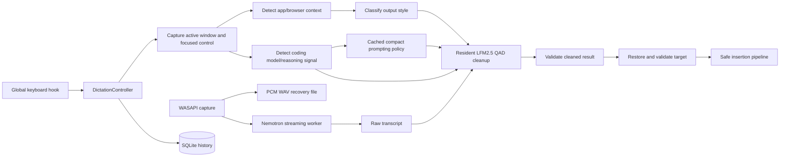

# Architecture

## Scope and runtime

FlowLocal is a Windows 11 x64 WPF tray application targeting .NET 9. `FlowLocal.slnx` contains:

- `src/FlowLocal.Core`: contracts, immutable models, and the recording state machine.
- `src/FlowLocal.App`: WPF UI and Windows/local-model integrations.
- `tests/FlowLocal.Core.Tests`: xUnit contract, integration, and smoke coverage.

The app is composed directly in `App.OnStartup`; there is no dependency-injection container or background service process.

## End-to-end dictation flow

On shortcut-down, `GlobalShortcutService` posts to the UI dispatcher and `DictationController` captures the foreground target. It immediately launches `CodingContextDetector` on the thread pool while app/browser context detection, history setup, ASR startup, and WASAPI capture continue normally. In Windows Terminal, the detector reads fixed Codex CLI, Claude Code, Oh My Pi, or Pi chrome through UI Automation; bundled status extensions provide exact Oh My Pi/Pi metadata for compact or custom layouts. In Claude Desktop Code and Codex Desktop Work, it reads only selected tabs and visible button/combo-box labels. Explicit title/status-line signals remain terminal fallbacks. Recording startup and release never await metadata detection.

On shortcut-up, capture stops and the WAV is finalized. The resident ASR session returns the complete English transcript. For coding targets, `PromptPolicyRegistry` selects a cached compact adaptation from `prompting-guides`, with a general rewrite-only fallback for unlisted or unavailable models. Missing effort retains the model's default policy. `SottoTranscriptCleaner` sends the selected prompt and a transcript-specific llama.cpp grammar to the resident LFM2.5 server. The grammar preserves substantive words, order, case, and technical tokens while permitting punctuation, layout, and leading-filler removal. `CleanupResultValidator` and `CodingCleanupValidator` reject invalid output. Cleanup is attempted twice, then falls back to the raw transcript with a recorded cleanup error. Non-coding cleanup retains its existing prompt and validation.

Before insertion, `ActiveTargetTracker` restores and validates the captured target. `ClipboardTextInsertionService` tries safe UI Automation, transactional clipboard paste, then Unicode `SendInput`. Terminal targets skip UI Automation and do not proceed past a failed or ambiguous paste. It refuses password/protected targets, higher/unknown integrity injection, mismatched focused elements, and stale targets. Clipboard-only fallback preserves the text for manual paste rather than claiming insertion succeeded.

## Local model boundaries

`CanaryAsrService` is a thin stdio client for the headless `FlowLocal.AsrWorker.exe` process, which runs [Nemotron Speech Streaming EN 0.6B](https://huggingface.co/handy-computer/nemotron-speech-streaming-en-0.6b-gguf) (Q4_K_M GGUF) through [transcribe.cpp](https://github.com/handy-computer/transcribe.cpp) 0.2.3 on the CPU backend. Audio is fed as 16 kHz mono float PCM during a session; streaming uses a parakeet right-context of 1 (approximately 80 ms lookahead) and greedy decoding with PnC disabled. The worker and session remain loaded between dictations, and partial events are available to the client even though only the final transcript is inserted.

`SottoTranscriptCleaner` starts one resident [llama.cpp](https://github.com/ggml-org/llama.cpp) `llama-server.exe` process for Liquid AI's [LFM2.5-1.2B-Instruct-GGUF](https://huggingface.co/LiquidAI/LFM2.5-1.2B-Instruct-GGUF), using `LFM2.5-1.2B-Instruct-QAD-Q4_0.gguf` with a deterministic chat prompt and streamed completion. `FLOWLOCAL_CLEANUP_DSPARK=1` adds the `LFM2.5-1.2B-Instruct-DSpark-Q4_K_M.gguf` sidecar through `draft-dspark`; streamed timings include draft and accepted-token counts. The packaged app carries the CPU server runtime; source runs can override model and executable paths with environment variables.

Both inference stages are local after prerequisites are present. First-time speech-model acquisition and normal package installation can use the network.

## Context detection and classification

`ActiveTargetTracker` snapshots process/window identity, focused UI Automation metadata, integrity information, and whether injection is safe. `ApplicationContextDetector` combines application metadata with `BrowserContextDetector`; browser detection extracts and normalizes a domain rather than retaining a full URL. `CodingContextDetector` accepts validated signals from supported terminals and desktop coding surfaces without a model allowlist. It never reads a global default to guess a live model.

`OutputStyleClassifier` applies rules in this order:

1. normalized-domain override;
2. normalized-executable override;
3. built-in known domain;
4. built-in known application;
5. focused-control hint;
6. generic browser;
7. general fallback.

Known domain groups include major webmail, AI chat, work/personal messaging, document, and Notion hosts. Known applications include Outlook/Word/Notepad/Notion/Obsidian/OneNote, common messaging clients, common code editors/IDEs, Claude, ChatGPT/Codex, and Windows terminal/shell processes. The authoritative tables are `ClassificationRules.cs`; user overrides live in `%LOCALAPPDATA%\FlowLocal\application-styles.json` and take precedence. Optional harness metadata adapters are packaged under `integrations`.

## Persistence and recovery

`SqliteHistoryRepository` owns `%LOCALAPPDATA%\FlowLocal\flowlocal.db` and stores session state, timestamps, raw/cleaned transcripts, normalized target metadata, styles/model labels, stage durations, insertion method, retry count, and errors. A nullable `coding_target_json` column stores captured harness/model/effort and detection provenance; initialization migrates older databases without changing existing rows. History renders that identity alongside ASR and cleanup models. Cleanup retries reuse the saved identity and the same constrained coding formatter; older coding rows without identity use general coding guidance. Recordings are `%LOCALAPPDATA%\FlowLocal\Recordings\<session-id>.wav`.

A history row is created before the recording file is opened so an interrupted session remains discoverable. At startup `CrashRecoveryService` scans nonterminal rows and offers recovery or deletion. History actions can copy/paste text, retry ASR/cleanup/insertion, play/export/open a recording, or delete data. Retention runs during initialization and after setting changes; defaults are seven days for audio and thirty days for transcript/history details.

`JsonStyleOverrideStore` persists style settings atomically. Invalid or unreadable JSON falls back to defaults with a diagnostic instead of preventing startup.

## UI and lifecycle

`App` owns the tray icon, Settings/History window, transient overlay, global hook, controller, local-model services, and persistence. Startup initializes history/recovery and both model backends before enabling dictation. The overlay exposes initialization, ready, listening, transcribing, cleaning, completion, target, insertion, and failure states without intentionally taking permanent focus. Exit disposes the hook, controller, capture/cleanup resources, ASR, and tray icon.

## Security and privacy boundaries

The application is designed for same-user, same-integrity desktop text targets. Target identity and focused element are revalidated before insertion. Password fields and unsafe integrity boundaries are blocked. Browser context is reduced to a normalized domain; full paths and query strings are neither displayed nor persisted. Audio/transcripts remain local and have user-controlled retention/deletion, but they are stored unencrypted under the Windows user profile and are accessible to that user and administrators.
