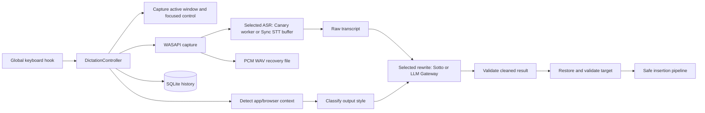

# Architecture

## Scope and runtime

FlowLocal is a Windows 11 x64 WPF tray application targeting .NET 9. `FlowLocal.slnx` contains:

- `src/FlowLocal.Core`: contracts, immutable models, and the recording state machine.
- `src/FlowLocal.App`: WPF UI and Windows/local-model integrations.
- `tests/FlowLocal.Core.Tests`: xUnit contract, integration, and smoke coverage.

The app is composed directly in `App.OnStartup`; there is no dependency-injection container or background service process.

## End-to-end dictation flow

On shortcut-down, `GlobalShortcutService` posts to the UI dispatcher. `DictationController` captures the foreground target, detects context, resolves style, creates a recoverable history row and WAV file, starts the selected `IAsrService` session, and starts WASAPI capture. Audio is written to the WAV and passed to ASR. Destination/style and recognition hints are fixed for that session, not recaptured after release.

On shortcut-up, capture stops and the WAV is finalized. ASR produces the complete English transcript. The selected `ITranscriptCleaner` formats it; `CleanupResultValidator` rejects empty, suspiciously expanded, refusal-like, or leaked-control-token output. Sotto retains its existing two-attempt policy. AssemblyAI makes one bounded Gateway request and returns `UsedFallback` with the exact raw transcript on failure; the controller does not retry that cloud request. History cleanup/ASR retries use the selected providers and the saved destination category.

Before insertion, `ActiveTargetTracker` restores and validates the captured target. `ClipboardTextInsertionService` tries safe UI Automation, transactional clipboard paste, then Unicode `SendInput`. Terminal targets skip UI Automation and do not proceed past a failed or ambiguous paste; text containing control characters is copied for review without being pasted, preventing embedded newlines from submitting a command. It refuses password/protected targets, higher/unknown integrity injection, mismatched focused elements, and stale targets. Clipboard-only fallback preserves the text for manual paste rather than claiming insertion succeeded.

## Local model boundaries

`CanaryAsrService` is a thin stdio client for the headless `FlowLocal.AsrWorker.exe` process, which runs [Canary 180M Flash](https://huggingface.co/handy-computer/canary-180m-flash-gguf) (Q4_K_M GGUF) through [transcribe.cpp](https://github.com/handy-computer/transcribe.cpp) on the CPU backend. Audio accumulates as 16 kHz mono float PCM during a session; at release the worker runs one `transcribe_run` call over the full buffer, so results are final-on-release. Decoding is greedy with punctuation/capitalization off (Sotto restores formatting), and timestamps, translation, and language detection are disabled. The model and session stay loaded between dictations; a half-second warm-up inference at init removes first-use graph setup from the first transcript. Missing model files are downloaded from Hugging Face at first init into `%LOCALAPPDATA%\FlowLocal\Models\canary-180m-flash-gguf`.

`SottoTranscriptCleaner` uses LLamaSharp to run [sotto-cleanup-lfm25-350m](https://huggingface.co/juanquivilla/sotto-cleanup-lfm25-350m) (`sotto-cleanup-lfm25-350m-q4_k_m.gguf`, Q4_K_M — a full fine-tune of LiquidAI/LFM2.5-350M-Base published by `juanquivilla`; the GGUF is converted from the BF16 checkpoint with llama.cpp's `convert_hf_to_gguf.py`). It reads the model from `FLOWLOCAL_CLEANUP_MODEL_PATH`, falling back to the `.gguf` in `%LOCALAPPDATA%\FlowLocal\Models` (preferring a `sotto-cleanup` file). Prompts use the model card's exact completion format — `### Input:` / `### Output:`, no chat template and no system prompt, since the base-model fine-tune was trained on that single fixed layout; decoding is greedy at temperature 0 with the card's `repetition_penalty=1.05` (penalty window covering the whole output, matching the HF reference) and `max_new_tokens = max(900, 1.5 x input_words)`, stopping at the next `###` marker like the card's example, on an 8192-token context and CPU inference by default (Q4_K_M benchmarked ~2.6x faster prompt processing than Q5_K_M at equivalent quality); setting `FLOWLOCAL_CLEANUP_GPU=1` requests full GPU offload with automatic fallback to CPU. The model stays loaded between requests. It neither downloads the GGUF nor searches beyond that directory.

These providers keep inference local after prerequisites are present. First-time speech-model acquisition and normal package installation can use the network.

## AssemblyAI boundaries

`App` loads saved provider settings before selecting existing `IAsrService` and `ITranscriptCleaner` implementations, with environment flags as fallback; see [configuration](../README.md#assemblyai-cloud-dictation). Key/provider controls remain available when initialization fails, and changes apply after restart. `AssemblyAIAsrService` buffers bounded 16 kHz S16LE mono audio and sends a single multipart request to `https://sync.assemblyai.com/transcribe` with model `universal-3-5-pro` on release. The same persistent HTTP client performs best-effort `/warm` calls at startup and session start. There is no async transcription job, polling loop, or automatic cloud ASR retry. Failed STT remains a recoverable session error.

`AssemblyAIPrompts` keeps recognition hints separate from rewrite profiles. `AssemblyAITranscriptCleaner` sends the raw transcript as user data with a category-specific system prompt to `https://llm-gateway.assemblyai.com/v1/chat/completions`. It uses a persistent HTTP client, temperature zero, a bounded output budget, and a five-second request deadline. Non-success HTTP responses, invalid/empty/truncated output, and timeouts return the raw transcript; explicit user cancellation still propagates.

Profiles preserve dictated meaning and distinguish email bodies, conversational messages, coding instructions, conservative terminal text, document prose, and generic text. No tools or action APIs are supplied. Prompting and lexical validation are safeguards, not a proof of semantic equivalence. Terminal control-character checks apply even when cleanup falls back to raw text.

## Context detection and classification

`ActiveTargetTracker` snapshots process/window identity, focused UI Automation metadata, integrity information, and whether injection is safe. `ApplicationContextDetector` combines application metadata with `BrowserContextDetector`; browser detection extracts and normalizes a domain rather than retaining a full URL. Domain lookup has a 250 ms wait budget. A recognizable domain or exact Gmail/Slack/Teams/Google Docs brand segment in the captured title is a lower-confidence fallback; address-bar evidence wins, and disabling website detection disables title-derived website hints too. Other detection failures retain the existing generic fallback.

`OutputStyleClassifier` applies rules in this order:

1. normalized-domain override;
2. normalized-executable override;
3. built-in known domain;
4. built-in known application;
5. focused-control hint;
6. generic browser;
7. general fallback.

Known domain groups include major webmail, AI chat, work/personal messaging, document, and Notion hosts. Known applications include Outlook/Word/Notepad/Notion/Obsidian/OneNote, common messaging clients, common code editors/IDEs, and Windows terminal/shell processes. The authoritative tables are `ClassificationRules.cs`; user overrides live in `%LOCALAPPDATA%\FlowLocal\application-styles.json` and take precedence.

## Persistence and recovery

`SqliteHistoryRepository` owns `%LOCALAPPDATA%\FlowLocal\flowlocal.db` and stores session state, timestamps, raw/cleaned transcripts, normalized target metadata, styles/model labels, stage durations, insertion method, retry count, and errors. Recordings are `%LOCALAPPDATA%\FlowLocal\Recordings\<session-id>.wav`.

A history row is created before the recording file is opened so an interrupted session remains discoverable. At startup `CrashRecoveryService` scans nonterminal rows and offers recovery or deletion. History actions can copy/paste text, retry ASR/cleanup/insertion, play/export/open a recording, or delete data. Retention runs during initialization and after setting changes; defaults are seven days for audio and thirty days for transcript/history details.

`JsonStyleOverrideStore` persists style settings atomically. Invalid or unreadable JSON falls back to defaults with a diagnostic instead of preventing startup.

## UI and lifecycle

`App` owns the tray icon, Settings/History window, transient overlay, global hook, controller, selected providers, and persistence. Startup initializes history/recovery and ASR before enabling dictation; cleanup unavailability is nonfatal because raw text can still be inserted. The overlay exposes initialization, ready, listening, transcribing, cleaning, completion, target, insertion, and failure states without intentionally taking permanent focus. Exit disposes the hook, controller, capture/cleanup resources, ASR, and tray icon. Debug-only timing output records bounded destination/profile labels and stage/post-release durations, never transcript text, full titles, or credentials.

## Security and privacy boundaries

The application is designed for same-user, same-integrity desktop text targets. Target identity and focused element are revalidated before insertion. Password fields and unsafe integrity boundaries are blocked. Browser context is reduced to a normalized domain; full paths and query strings are neither displayed nor persisted. Local history is unencrypted under the Windows user profile and accessible to that user and administrators.

With local providers, inference stays on-device. Cloud ASR uploads audio, a short destination prompt, and bounded optional keyterms; cloud rewriting uploads raw transcript text and the category's fixed rewrite prompt. Full window titles and focused-control names are not sent as prompts, but short code filenames extracted from editor titles may become keyterms. Vocabulary and manually maintained correction values are optional hints, not automatic transcript substitutions. There is no selected-text/nearby-content scraping. The optional saved API key is masked in Settings and encrypted with Windows DPAPI (`CurrentUser`) in `app-settings.json`; it takes precedence over `ASSEMBLYAI_API_KEY`. An unreadable saved key requires re-entry rather than silently switching credentials. DPAPI protects the on-disk value, not against other processes running as the same Windows user. Local retention/deletion does not manage AssemblyAI-side data; the configured account/provider policy governs it.
