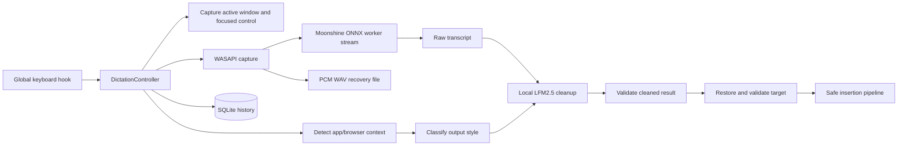

# Architecture

## Scope and runtime

FlowLocal is a Windows 11 x64 WPF tray application targeting .NET 9. `FlowLocal.slnx` contains:

- `src/FlowLocal.Core`: contracts, immutable models, and the recording state machine.
- `src/FlowLocal.App`: WPF UI and Windows/local-model integrations.
- `tests/FlowLocal.Core.Tests`: xUnit contract, integration, and smoke coverage.

The app is composed directly in `App.OnStartup`; there is no dependency-injection container or background service process.

## End-to-end dictation flow

On shortcut-down, `GlobalShortcutService` posts to the UI dispatcher. `DictationController` captures the foreground target, detects context, resolves style, creates a recoverable history row and WAV file, starts an ASR session in `FlowLocal.AsrWorker.exe`, and starts WASAPI capture. Audio is written to the WAV and streamed to the worker.

On shortcut-up, capture stops and the WAV is finalized. ASR produces the complete English transcript. `LfmTranscriptCleaner` formats it using the resolved `TranscriptStyle`; `CleanupResultValidator` rejects empty, suspiciously expanded, refusal-like, or leaked-control-token output. Cleanup is attempted twice, then falls back to the raw transcript with a recorded cleanup error.

Before insertion, `ActiveTargetTracker` restores and validates the captured target. `ClipboardTextInsertionService` tries safe UI Automation, transactional clipboard paste, then Unicode `SendInput`. Terminal targets skip UI Automation and do not proceed past a failed or ambiguous paste. It refuses password/protected targets, higher/unknown integrity injection, mismatched focused elements, and stale targets. Clipboard-only fallback preserves the text for manual paste rather than claiming insertion succeeded.

## Local model boundaries

`MoonshineAsrService` is a thin stdio client for the headless `FlowLocal.AsrWorker.exe` process, which runs [Moonshine streaming-medium](https://huggingface.co/moonshine-ai/moonshine-streaming-medium) through Microsoft.ML.OnnxRuntime (CPU). Audio accumulates as 16 kHz mono float PCM during a session; at release the worker runs the frontend/encoder/adapter graphs over the full buffer and greedy-decodes with `decoder_kv.onnx`, so results are final-on-release. Missing model files are downloaded from Hugging Face at first init into `%LOCALAPPDATA%\FlowLocal\Models\moonshine-streaming-medium`.

`LfmTranscriptCleaner` uses LLamaSharp. It reads the model from `FLOWLOCAL_CLEANUP_MODEL_PATH`, falling back to the most recently written `.gguf` in `%LOCALAPPDATA%\FlowLocal\Models`. It uses an 8192-token context, temperature-0 sampling with a repeat penalty, and CPU inference by default; setting `FLOWLOCAL_LFM_GPU=1` requests full GPU offload with automatic fallback to CPU. It neither downloads the GGUF nor searches beyond that directory.

Both inference stages are local after prerequisites are present. First-time speech-model acquisition and normal package installation can use the network.

## Context detection and classification

`ActiveTargetTracker` snapshots process/window identity, focused UI Automation metadata, integrity information, and whether injection is safe. `ApplicationContextDetector` combines application metadata with `BrowserContextDetector`; browser detection extracts and normalizes a domain rather than retaining a full URL.

`OutputStyleClassifier` applies rules in this order:

1. normalized-domain override;
2. normalized-executable override;
3. built-in known domain;
4. built-in known application;
5. focused-control hint;
6. generic browser;
7. general fallback.

Known domain groups include major webmail, AI chat, work/personal messaging, document, and Notion hosts. Known applications include Outlook/Word/Notepad/Notion/Obsidian/OneNote, common messaging clients, common code editors/IDEs, and Windows terminal/shell processes. The authoritative tables are `ClassificationRules.cs`; user overrides live in `%LOCALAPPDATA%\FlowLocal\application-styles.json` and take precedence.

## Persistence and recovery

`SqliteHistoryRepository` owns `%LOCALAPPDATA%\FlowLocal\flowlocal.db` and stores session state, timestamps, raw/cleaned transcripts, normalized target metadata, styles/model labels, stage durations, insertion method, retry count, and errors. Recordings are `%LOCALAPPDATA%\FlowLocal\Recordings\<session-id>.wav`.

A history row is created before the recording file is opened so an interrupted session remains discoverable. At startup `CrashRecoveryService` scans nonterminal rows and offers recovery or deletion. History actions can copy/paste text, retry ASR/cleanup/insertion, play/export/open a recording, or delete data. Retention runs during initialization and after setting changes; defaults are seven days for audio and thirty days for transcript/history details.

`JsonStyleOverrideStore` persists style settings atomically. Invalid or unreadable JSON falls back to defaults with a diagnostic instead of preventing startup.

## UI and lifecycle

`App` owns the tray icon, Settings/History window, transient overlay, global hook, controller, local-model services, and persistence. Startup initializes history/recovery and both model backends before enabling dictation. The overlay exposes initialization, ready, listening, transcribing, cleaning, completion, target, insertion, and failure states without intentionally taking permanent focus. Exit disposes the hook, controller, capture/cleanup resources, ASR, and tray icon.

## Security and privacy boundaries

The application is designed for same-user, same-integrity desktop text targets. Target identity and focused element are revalidated before insertion. Password fields and unsafe integrity boundaries are blocked. Browser context is reduced to a normalized domain; full paths and query strings are neither displayed nor persisted. Audio/transcripts remain local and have user-controlled retention/deletion, but they are stored unencrypted under the Windows user profile and are accessible to that user and administrators.
